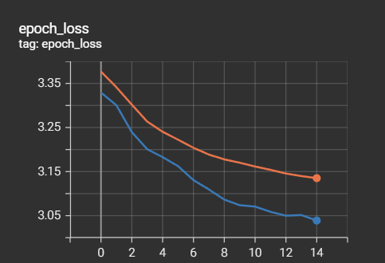

# comand-classification

classying single word commands using deep learning.
The projects make use of the google commands dataset and uses a basic CNN with softmax to classify between the different words.

## Tech Stack:

TensorFlow/Keras (2.10.1): For building, training the CRNN model and building the datapipline.
NumPy: For numerical operations.
Matplotlib: For visualizing the results.

## Training progress:

During the training the loss and accuracy improve as shown below:

